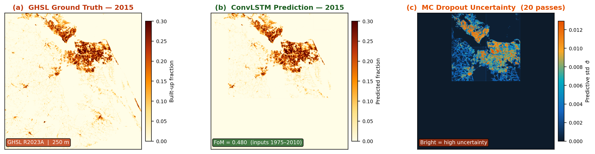
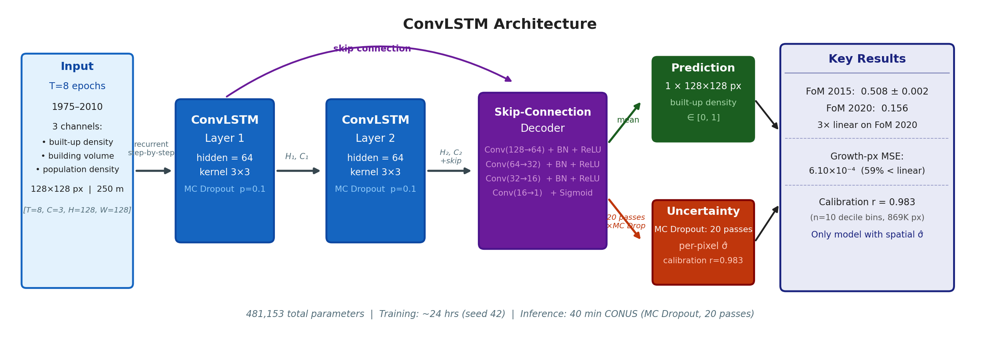
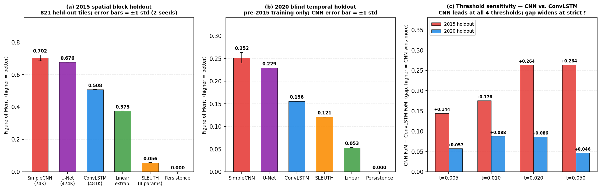
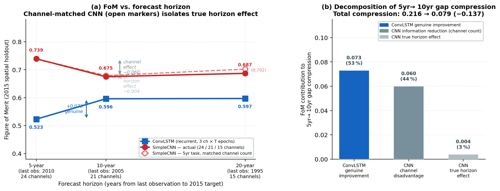
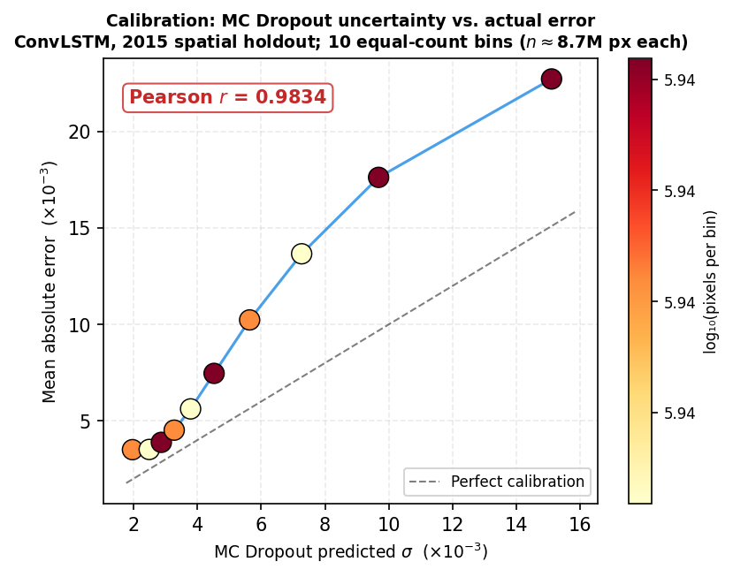

# Multi-Horizon Urban Growth Prediction

A spatio-temporal deep learning benchmark for forecasting urban built-up surface density across the Continental United States (CONUS) at 250 m resolution. The repository contains the full experimental pipeline behind a six-model evaluation (CNN, U-Net, ConvLSTM with MC Dropout, linear extrapolation, SLEUTH cellular automata, and persistence) over 45 years of Global Human Settlement Layer (GHSL) observations.



The repository is intended for reproducibility of the experiments. Trained model weights, raw GHSL rasters, and any conference paper artifacts are intentionally not committed. The Data section below explains how to download and preprocess the public source data.

## Contents

| Path | Purpose |
|------|---------|
| `src/models/` | ConvLSTM (with MC Dropout), SLEUTH cellular automaton |
| `src/utils/` | Training loop, inference, evaluation metrics (FoM, growth decomposition) |
| `scripts/` | One driver per experiment (preprocessing, training, evaluation, figure generation) |
| `tests/` | Unit tests for the model and metric implementations |
| `results/metrics/` | Final JSON outputs of every experiment used in the analysis |
| `results/figures/` | Final PDF and PNG figures generated from `results/metrics/` |
| `docs/` | Installation guide and model card |

Local-only directories that are not pushed: `data/`, `geotiff_exports/`, `models/`, `paper/`, `logs/`, `notebooks/`.

## Experiments

Each experiment is implemented as a single self-contained script under `scripts/`. The list below maps each experimental claim to the script that produces it and the JSON file it writes.

### 1. Main 2015 spatial-block holdout

CONUS is split into 1280 by 1280 pixel geographic blocks of roughly 320 km^2. Every fifth block is held out, producing 821 validation tiles that share no pixels with the training set.

| Script | Produces |
|--------|----------|
| `scripts/preprocess_all_data.py` | Resamples and reprojects GHSL rasters into `geotiff_exports/` |
| `scripts/train_3channel.py` | ConvLSTM + MC Dropout (seed 42) |
| `scripts/train_convlstm_seed0.py` | ConvLSTM + MC Dropout (seed 0) |
| `scripts/cnn_multiseed.py` | Flat-stacking CNN (seeds 0 and 42) |
| `scripts/train_unet_seed0.py` | U-Net (seeds 0 and 42) |
| `scripts/train_sota_baselines.py` | SLEUTH cellular automaton calibration |
| `scripts/validate_2015.py` | Aggregated 2015 pixel-level FoM, MSE, MAE, R^2 |

### 2. 2020 blind temporal holdout

GHSL 2020 was downloaded only after all model selection on the 2015 holdout had completed. The input window is shifted to [1980, 2015] with target 2020 and every model is evaluated on the same 1.57 M-pixel domain.

| Script | Produces |
|--------|----------|
| `scripts/preprocess_2020.py` | Builds the 2020 evaluation tensors |
| `scripts/validate_2020.py` | ConvLSTM, linear extrapolation, persistence |
| `scripts/cnn_2020_holdout.py` | CNN multiseed on 2020 |
| `scripts/unet_2020_holdout.py` | U-Net on 2020 |
| `scripts/unet_2020_pixel_filtered.py` | U-Net 2020 recomputed on the gt > 0.01 mask used for all other models |
| `scripts/sleuth_2020_holdout.py` | SLEUTH on 2020 |

### 3. Multi-horizon forecasting

All experiments predict the 2015 epoch. Forecast horizon is varied by truncating the input window so that the last observed epoch is 2010 (5 year), 2005 (10 year), or 1995 (20 year).

| Script | Produces |
|--------|----------|
| `scripts/train_multihorizon.py` | ConvLSTM at 5, 10, and 20 year horizons |
| `scripts/run_cnn_multihorizon.py` | CNN at 5, 10, and 20 year horizons |
| `scripts/run_cnn_channel_control.py` | CNN with input channel count held fixed to isolate the true horizon effect from the channel-count confound |
| `scripts/reeval_multihorizon.py` | Re-evaluates every horizon checkpoint under the unified pixel mask |
| `scripts/make_multihorizon_figure.py` | Generates `fig_multihorizon` |

### 4. Ablations

| Script | Variable |
|--------|----------|
| `scripts/run_ablations_3ch.py` | Sequence length (number of input timesteps) and channel ablations |
| `scripts/channel_attribution_ci.py` | Bootstrap confidence intervals on the channel-attribution effect |

### 5. Threshold sensitivity

| Script | Produces |
|--------|----------|
| `scripts/threshold_sensitivity.py` | FoM for CNN, U-Net, and ConvLSTM at change thresholds t in {0.005, 0.01, 0.02, 0.05} on both holdouts |

### 6. Per-tile statistics

| Script | Produces |
|--------|----------|
| `scripts/compute_pertile_fom.py` | Per-tile FoM with paired Wilcoxon signed-rank test and bootstrap 95% CIs |
| `scripts/gen_pertile_scatter.py` | Per-tile scatter plot |

### 7. Calibrated uncertainty

| Script | Produces |
|--------|----------|
| `scripts/generate_uncertainty_maps.py` | MC Dropout uncertainty maps over the validation tiles (20 stochastic forward passes per pixel) |

### 8. Cross-region transfer

| Script | Region |
|--------|--------|
| `scripts/eval_lagos_full.py`, `scripts/eval_lagos_transfer.py` | Zero-shot transfer evaluation to Lagos, Nigeria |

### 9. Figure generation

| Script | Produces |
|--------|----------|
| `scripts/generate_figures.py` | Re-creates every figure under `results/figures/` |
| `scripts/make_architecture_figure.py`, `make_architecture_cnn.py`, `make_architecture_unet.py` | Architecture diagrams |
| `scripts/make_paper_fom_figure.py` | Headline FoM comparison panel |

## Architecture



The primary model stacks two ConvLSTM layers (hidden 64, kernel 3 by 3) followed by a skip-connection decoder of four Conv + BN + ReLU blocks ending in a 1 by 1 sigmoid head. Monte Carlo dropout with p = 0.1 is applied after each ConvLSTM layer and remains active at inference time. Total parameters: 481,153. Input tensor shape: T=8 time steps by 3 channels by 128 by 128 pixels.

The two ablation architectures (flat-stacking CNN at 74 K parameters and U-Net at 474 K parameters) share the same decoder. The only architectural variable across the three deep models is how the eight input epochs are encoded: channel concatenation versus a recurrent hidden state.

## Headline results

### 2015 spatial block holdout

Pixel-level FoM on 1,542,747 evaluation pixels (gt > 0.01 mask, 25.1 percent growth). Mean and standard deviation are computed across two random seeds for the neural models.

| Model | FoM (higher is better) | Parameters |
|-------|------------------------|------------|
| SimpleCNN (flat stacking) | 0.702 +/- 0.019 | 74 K |
| U-Net | 0.676 | 474 K |
| ConvLSTM + MC Dropout | 0.508 +/- 0.0001 | 481 K |
| Linear extrapolation | 0.375 | -- |
| SLEUTH | 0.056 | 4 (hyperparameters) |
| Persistence | 0.000 | -- |

### 2020 blind temporal holdout

Pre-2015 training only. Evaluation domain (gt > 0.01) is identical across all six models, 1,574,225 pixels with 10.57 percent growth.

| Model | FoM | MSE |
|-------|-----|-----|
| SimpleCNN | 0.252 +/- 0.012 | 4.90e-4 |
| U-Net | 0.229 | 4.30e-4 |
| ConvLSTM + MC Dropout | 0.156 | 4.84e-4 |
| SLEUTH | 0.121 | -- |
| Linear extrapolation | 0.053 | 9.40e-4 |
| Persistence | 0.000 | 2.40e-4 (lowest) |

Persistence achieves the lowest MSE because 89 percent of evaluated pixels are stable. This metric inversion is the reason FoM is reported as the primary metric.



### Multi-horizon analysis



The 5-year-to-10-year compression of the CNN versus ConvLSTM gap is decomposed into three components: genuine ConvLSTM improvement (+0.073), CNN channel disadvantage (+0.060, fewer input channels at longer horizons), and CNN true horizon effect (+0.004). Most of the apparent ConvLSTM catch-up at longer horizons is a channel-count confound, not a representational benefit.

### Calibrated uncertainty



Pearson correlation between MC Dropout predicted standard deviation and the binned actual absolute error is r = 0.9834 across 8.68 M validation pixels. Spearman rank correlation is 1.000: every higher-uncertainty decile bin has strictly larger mean actual error than the bin below it.

## Data

The pipeline uses the European Commission Joint Research Centre Global Human Settlement Layer (GHSL) R2023A products. Raw rasters are not stored in this repository.

| Layer | Product | Epochs |
|-------|---------|--------|
| Built-up surface density | GHS-BUILT-S R2023A | 1975, 1980, 1985, 1990, 1995, 2000, 2005, 2010, 2015, 2020 |
| Built-up volume | GHS-BUILT-V R2023A | 1975 to 2020 |
| Population density | GHS-POP R2023A | 1975 to 2020 |

Download the global 100 m or 3-arcsecond products from the official portal:

> https://human-settlement.emergency.copernicus.eu/download.php

Place each downloaded GeoTIFF under `data/` (the folder is gitignored), then run:

```bash
python scripts/preprocess_all_data.py
```

The preprocessing step reprojects all layers to EPSG:5070 (Albers Equal Area, CONUS), resamples to 250 m, clips to the CONUS extent (12,717 by 23,996 pixels = 305 M pixels), and writes the result to `geotiff_exports/`. The 2020 epoch used for the blind temporal holdout is built by `scripts/preprocess_2020.py`.

## Installation

```bash
git clone https://github.com/rohanbalixz/Multi-Horizon-Urban-Growth-Prediction.git
cd Multi-Horizon-Urban-Growth-Prediction
python -m venv .venv
source .venv/bin/activate
pip install -r requirements.txt
```

Full system requirements and platform-specific notes are in [docs/INSTALLATION.md](docs/INSTALLATION.md).

## Reproducing all experiments

After installing dependencies and running `scripts/preprocess_all_data.py`:

```bash
# Main models
python scripts/train_3channel.py
python scripts/train_convlstm_seed0.py
python scripts/cnn_multiseed.py
python scripts/train_unet_seed0.py
python scripts/train_sota_baselines.py

# Multi-horizon
python scripts/train_multihorizon.py
python scripts/run_cnn_multihorizon.py
python scripts/run_cnn_channel_control.py

# Ablations
python scripts/run_ablations_3ch.py

# 2015 + 2020 evaluation
python scripts/validate_2015.py
python scripts/preprocess_2020.py
python scripts/validate_2020.py
python scripts/cnn_2020_holdout.py
python scripts/unet_2020_holdout.py
python scripts/unet_2020_pixel_filtered.py
python scripts/sleuth_2020_holdout.py

# Per-tile statistics and threshold sensitivity
python scripts/compute_pertile_fom.py
python scripts/threshold_sensitivity.py

# Uncertainty maps (MC Dropout, 20 passes)
python scripts/generate_uncertainty_maps.py

# Figures
python scripts/generate_figures.py
python scripts/make_multihorizon_figure.py
python scripts/make_paper_fom_figure.py
python scripts/make_architecture_figure.py
```

Final aggregated numbers are written to `results/metrics/all_results.json` by `scripts/consolidate_results.py`.

## Evaluation protocol

* Validation tiles: 821 geographic blocks selected by `block_id mod 5 == 0` and stored in `results/metrics/val_tile_indices.json`. The same tile list is used by every model and every script in this repo.
* Evaluation mask: `gt > 0.01` on the target epoch, restricting Figure of Merit to pixels with meaningful built-up coverage.
* Figure of Merit (Pontius et al., 2008): B / (A + B + C), where B is correctly predicted growth, A is missed growth, and C is false growth. True negatives are excluded from the denominator, so FoM is robust to the 89 percent stable background of CONUS.
* Multi-seed: every neural model is trained with two seeds (0 and 42); reported numbers are the mean and standard deviation across seeds.
* Statistical confirmation: paired Wilcoxon signed-rank test on per-tile FoM values, plus bootstrap 95 percent confidence intervals on the gap (`scripts/compute_pertile_fom.py`).

## Pre-trained weights

Trained model checkpoints are not distributed with this repository. To regenerate them, run the training scripts listed above on a machine with a CUDA-capable GPU. Each ConvLSTM training run takes approximately 24 hours on a single A100; CNN and U-Net training take 1 to 2 hours each.

## Citation

```bibtex
@software{bali_mhugp_2026,
  author  = {Bali, Rohan},
  title   = {Multi-Horizon Urban Growth Prediction},
  year    = {2026},
  url     = {https://github.com/rohanbalixz/Multi-Horizon-Urban-Growth-Prediction}
}
```

## License

This project is released under the MIT License. See [LICENSE](LICENSE) for the full text.
